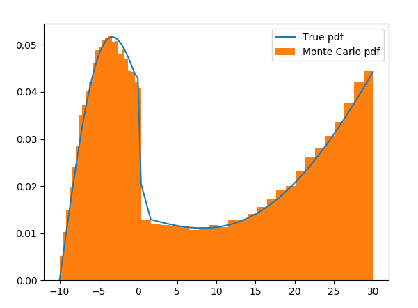
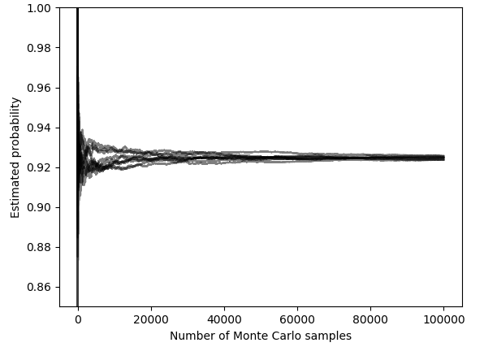
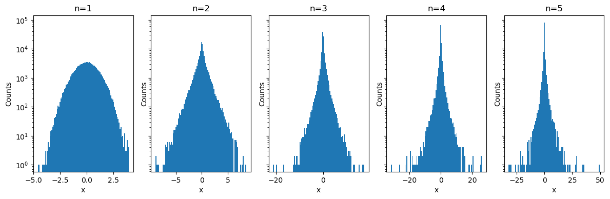

# Lecture 3 activities & experiments

## Sampling from a discrete distribution

## Monte Carlo estimation of a probability related to sums of Bernoulli random variables

## Probability density function of a product of Gaussians

## Scalar stochastic system with multiplicative and additive noise

